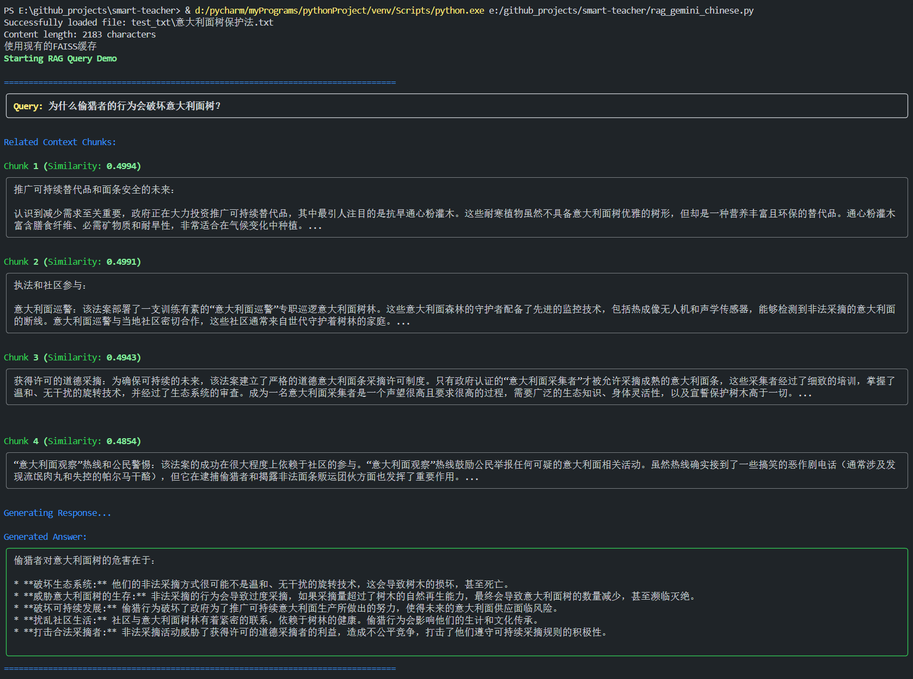

# Smart Teacher

An Intelligent Q&A System Based on RAG (Retrieval-Augmented Generation)

## Project Overview

Smart Teacher is an experimental question-answering system based on RAG (Retrieval-Augmented Generation) technology. The system processes text into chunks, utilizes vector retrieval technology to find the most relevant content, and combines with LLM to generate accurate answers.

## Key Features

- Efficient vector similarity retrieval using FAISS
- Integration with Google AI Studio's Gemini-2.0-flash model
- API access restrictions resolved through Deno proxy service
- Support for text chunking and vector encoding caching

## Technical Architecture

- Text Encoding: Google text-embedding-004
- Vector Retrieval: Facebook AI Similarity Search (FAISS)
- Large Language Model: Gemini-2.0-flash
- Proxy Service: Deno Deploy

## Prerequisites

1. Get your API Key
   - Visit [Google AI Studio](https://aistudio.google.com/apikey) to register and obtain your API key
   - Set the API key as an environment variable:
     ```bash
     # For Linux/macOS
     export GOOGLE_API_KEY='your_api_key_here'
     
     # For Windows (PowerShell)
     $env:GOOGLE_API_KEY='your_api_key_here'
     
     # For Windows (Command Prompt)
     set GOOGLE_API_KEY=your_api_key_here
     ```

## Usage

### Parameter Configuration

- `update_faiss`: Controls whether to update the FAISS index
  - `True`: Force index update
  - `False`: Use cached index (if available)
- `topk`: Number of most similar text chunks to retrieve

### Example Output



## Limitations

The current version is experimental and has the following limitations:
- Text preprocessing methods need optimization
- Chunking strategies require further improvement
- Only basic retrieval functionality is supported

## License

This project is released under the MIT License

## Contributing

Issues and Pull Requests are welcome to help improve the project.